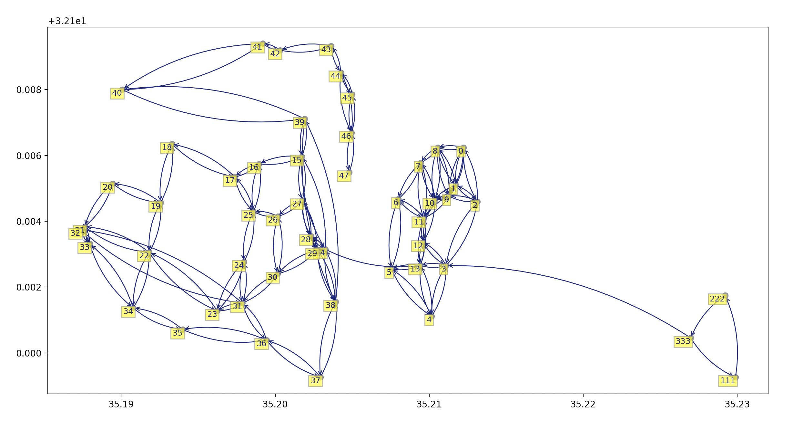

# OOP Ex3

- [OOP Ex3](#oop-ex3)
    * [What does this repo contain?](#what-does-this-repo-contain-)
        + [Requirements](#requirements)
        + [Usage](#usage)
    * [Features](#features)
        + [Graph features](#graph-features)
        + [Visual features](#visual-features)
    * [Performance](#performance)
    

## What does this repo contain?
This repo contains an implementation of a directed weighted graph in Python. 
A couple of path finding and grouping algorithms were implemented and compared to the [NetworkX](https://github.com/networkx) library and our [previous Java implementation](https://github.com/yurig93/oop_ex2).

### Requirements
- Python 3.8 or higher.
- Unix based machine (recommended).

### Usage
First clone this repo. Then run the tests to make sure all is working fine. 
After that you should be able to import the implemented classes from the src folder.
```sh
# git clone this repository
$ git clone https://github.com/yurig93/oop_ex3.git
$ cd oop_ex3

# install reqs (better to do in a virtualenv)
$ pip install -r requirements.txt

# run the tests
$ cd tests && PYTHONPATH="$(pwd):$(pwd)/../src/:$(pwd)/../:$PYTHONPATH" python -m unittest test_* ; cd ../
# .................................
# ----------------------------------------------------------------------
# Ran 33 tests in 0.010s
# 
# OK

```

## Features
### Graph features
This repo contains an implementation for a directed weighted graph under `src/`.
It also contains a set of graph algorithms to be used found in the `GraphAlgo` class.
More examples can be found in the at `tests/`, `src/GraphAlgoInterface.py` and `src/GraphInterface.py`
- Build a graph with nodes and edges using a simple API
    ```python
    from DiGraph import DiGraph
    g = DiGraph()
    g.add_node(1, (1, 2, 3))
    g.add_node(2, (3, 2, 1))
    g.add_edge(1, 2, 4)
    ```

- Save / Load a graph
    ```python
    from DiGraph import DiGraph
    from GraphAlgo import GraphAlgo
    g = DiGraph()
    g.add_node(1, (1, 2, 3))
    algo = GraphAlgo(g)
    algo.save_to_json("/tmp/g.json")
    ```

- Find strongly connected components using [Tarjan's algorithm](https://en.wikipedia.org/wiki/Tarjan%27s_strongly_connected_components_algorithm).
    ```python
    from DiGraph import DiGraph
    from GraphAlgo import GraphAlgo
    g = DiGraph()
    g.add_node(1)
    g.add_node(2)
    algo = GraphAlgo(g)
    print(algo.connected_components())
    ```

- Find the shortest path between nodes using [Dijkstra](https://en.wikipedia.org/wiki/Dijkstra%27s_algorithm) and get their distance.
    ```python
    from DiGraph import DiGraph
    from GraphAlgo import GraphAlgo
    g = DiGraph()
    g.add_node(1)
    g.add_node(2)
    g.add_node(3)
    g.add_node(4)
    g.add_edge(1,2, 555)
    g.add_edge(1,3, 10)
    g.add_edge(2,4, 1)
    g.add_edge(3,4, 1)
    
    algo = GraphAlgo(g)
    print(algo.shortest_path(1,4))
    ```


### Visual features
The implementation visualizes the graph on the screen. It supports fixated (x,y) coordinates and NULL coordinates. It will first draw on screen any node with a known position.
Then the world boundaries will be determined for further ratio calculations. 

Each strongly connected component (SCC) with a node that does not have a `GeoLocation` will be assigned a new position for the designated place for the SCC on the map.
The positioning algorithm works by creating a starting radius and a target point, it then checks if that point is overlapping other nodes. If that happens it will continue rotating the angle and enlarging the radius until a proper point is found.
In the image below the nodes `111, 222, 333` were positioned by the algorithm. Inspired by [this](https://en.wikipedia.org/wiki/Force-directed_graph_drawing) but not quite the same.




## Performance
Please visit the [wiki](https://github.com/yurig93/oop_ex3/wiki) :)